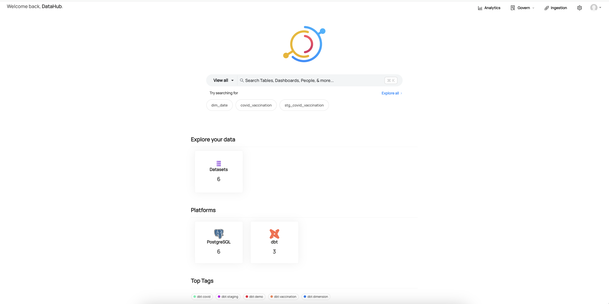
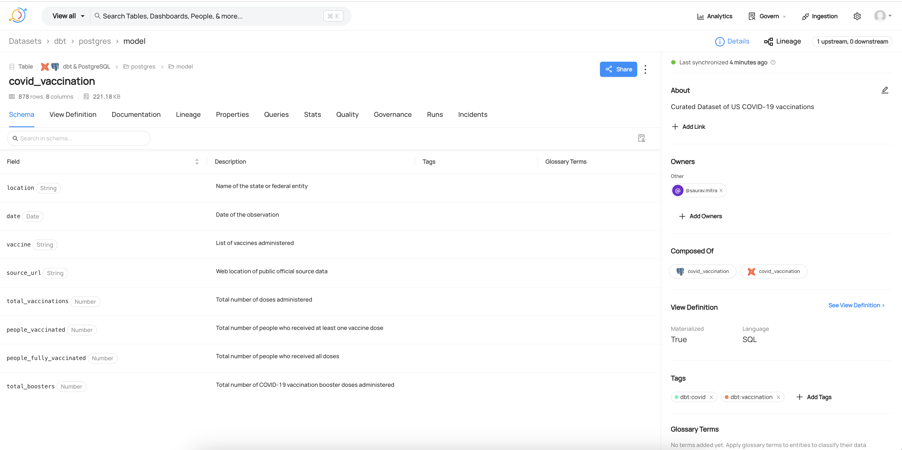
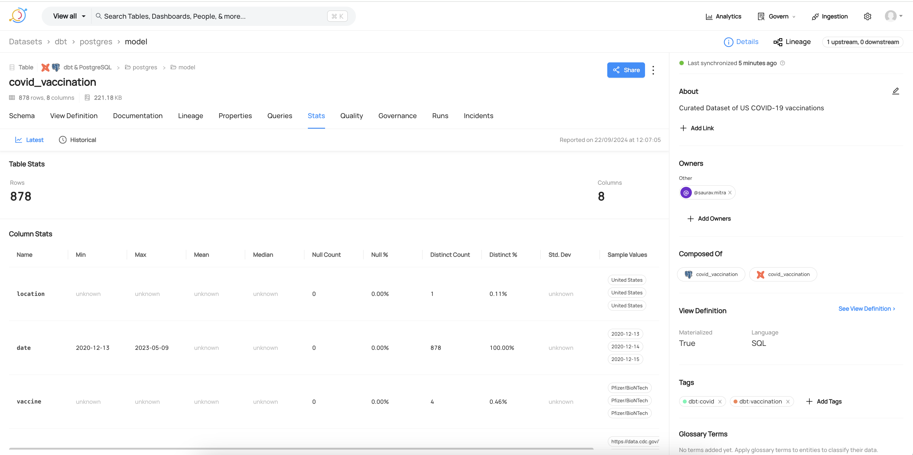
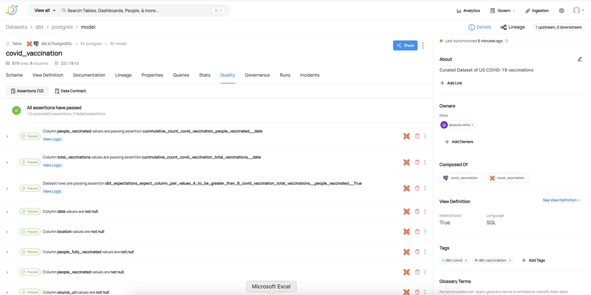
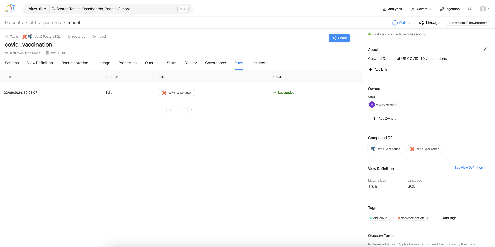
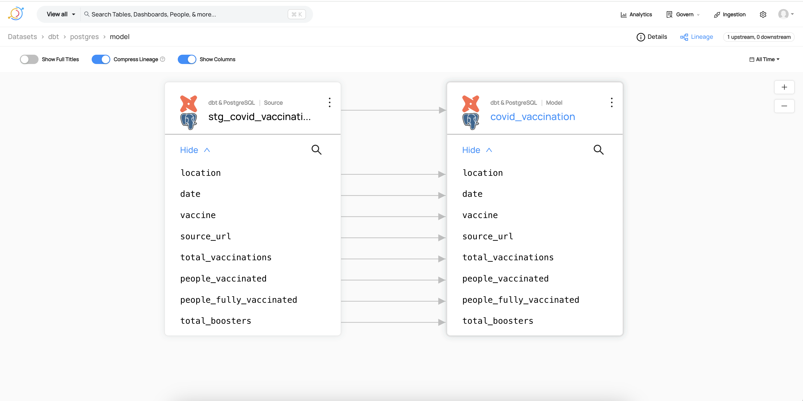
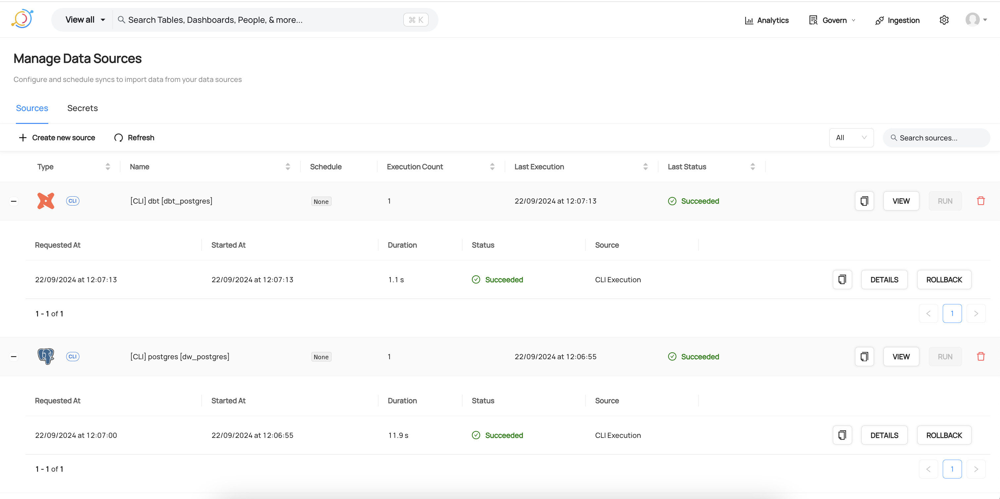

# data-governance-demo
This repository contains the source code for Data Governance demo, for COVID Vaccine dataset using Datahub.

## Setup Instructions
- Pre-requisites:
<br/>Install Docker & Docker Compose if not already installed.

- Clone the repository:
```
git clone https://github.com/sarubhai/dg-demo.git
```
- Installation:
```
cd dg-demo
docker compose -f docker-compose.yml up -d
```
Wait for some time for all the containers to be ready
<br/>Open your web browser and navigate to http://localhost:9002
<br/>Username: datahub
<br/>Password: P@ssw0rd!234

- Cleanup:
```
docker compose -f docker-compose.yml down -v
```

## Data Source
- https://github.com/owid/covid-19-data/tree/master/public/data/vaccinations
- https://raw.githubusercontent.com/owid/covid-19-data/master/public/data/vaccinations/country_data/United%20States.csv


## Data Ingestion
A Python based script for Data Ingestion & Loading
- Download the vaccination dataset from the GitHub URL
To efficiently download large data files without consuming significant memory, we can utilize Python's requests library with chunked streaming. Each smaller chunk is directly written to the disk, ensuring minimal memory usage throughout the download process. This method is especially useful when handling large files where memory constraints are a concern.

- Load the vaccination dataset into PostgreSQL
To efficiently load large datasets into PostgreSQL using psycopg2, the COPY command can be executed via the copy_expert() function, allowing bulk inserts directly from a file. This approach minimizes overhead and significantly improves performance compared to row-by-row inserts.


## DataHub Setup
Here we have a Docker Compose file defining a multi-service architecture.

### Kafka Broker:
- Uses Confluent Kafka image (confluentinc/cp-kafka:7.4.0)
- Uses KRaft consensus mode, eliminating the need for Zookeeper

### Schema Registry:
- Uses Confluent Schema Registry image (confluentinc/cp-schema-registry:7.4.0)
- Provides a centralized repository for Kafka topics' schemas

### Elasticsearch:
- Uses Elasticsearch image (elasticsearch:7.10.1)
- Elasticsearch is used both as a graph database and for document indexing and search
- Configured as a single node setup with security enabled 

### MySQL Database:
- Use Mariadb image (mariadb:10.5.8)
- Stores DataHub metadata and other relevant data


### DataHub Services:
- DataHub Upgrade: Updates DataHub's system using the latest configurations
- DataHub GMS: The core backend service responsible for metadata and graph management
- DataHub Actions & Frontend React: Handles actions and serves the user interface for DataHub
- These services depend on Kafka, Elasticsearch, and MySQL


### PostgreSQL:
- Uses Postgresql image (postgres:14-alpine)
- Acts as a data warehouse
- Stores data ingestion results

### Data Ingestion and Transformation:
- Data Ingestion: Loads data to PostgreSQL
- DBT (Data Build Tool): Used for data transformation, data tests and data documentation

### Metadata Ingestion (PostgreSQL & DBT):
- Ingests metadata from PostgreSQL and DBT projects to DataHub

Persistent storage is provided using Docker volumes for Kafka, Elasticsearch, MySQL, and PostgreSQL data.
This architecture is designed to set up DataHub, a platform for metadata management, data discovery, and data governance, using Kafka for event streaming, Elasticsearch for search indexing, MySQL for metadata storage, and PostgreSQL for data warehousing.


## Data Quality Checks
Implemented Data Quality (DQ) checks Using DBT Framework for completeness, consistency, conformity, accuracy, and timeliness.

- Completeness: Ensures that critical columns ('location', 'date', 'vaccine', 'source_url', 'total_vaccinations', 'people_vaccinated', 'people_fully_vaccinated') are present and have no missing values.

- Conformity: 
  Validates that the 'date' column as text has exactly 10 characters

- Consistency: Check for inconsistencies in data, and logical relationships between columns.
<br/>&nbsp;&nbsp;&nbsp;&nbsp;- Ensure the 'vaccine' values match a predefined list of valid vaccines 
<br/>&nbsp;&nbsp;&nbsp;&nbsp;&nbsp;&nbsp;&nbsp;('Johnson&Johnson', 'Moderna', 'Novavax', 'Pfizer/BioNTech')
<br/>&nbsp;&nbsp;&nbsp;&nbsp;- Checks that 'total_vaccinations' is always greater than or equal to 'people_vaccinated'
  

- Accuracy: Uses unique constraints and value-based checks to ensure data is logically correct.
<br/>&nbsp;&nbsp;&nbsp;&nbsp;- Ensure 'date' column is unique
  Ensures cumulative counts for 'total_vaccinations' & 'people_vaccinated' does not  decrease over time.

- Timeliness: Ensure data in the source table is up-to-date and reflects the most recent information.
<br/>&nbsp;&nbsp;&nbsp;&nbsp;- Freshness checks- warn_after: 12 hours, error_after: 24 hours


## Screenshots
#### Dathub Homepage

#### Dataset Schema

#### Dataset Statistics

#### Data Quality Tests

#### DBT Runs

#### Dataset Lineage

#### Metadata Ingestion Pipelines

